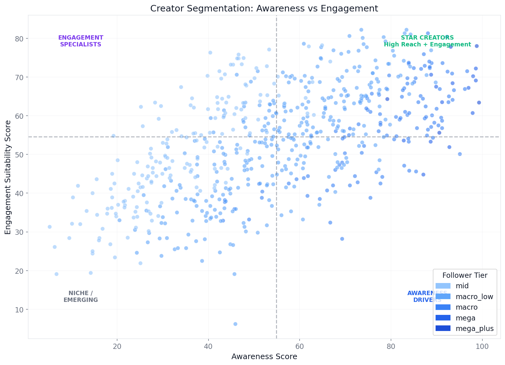
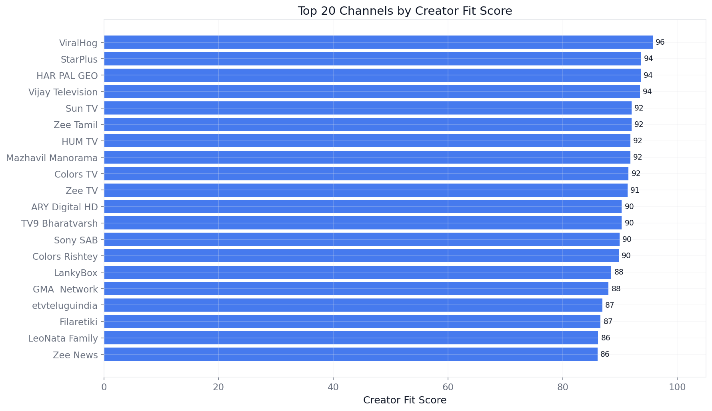
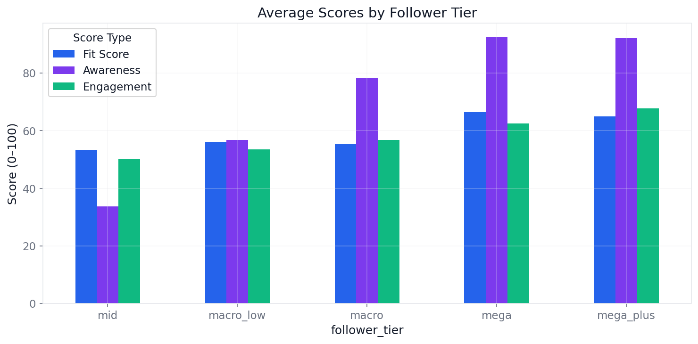
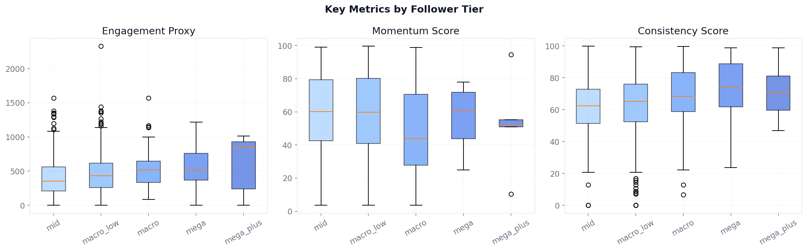

# Creator Campaign Intelligence for Partnerships Teams

> **Prototype project.** Built with public data to demonstrate creator analytics workflow. Not a production system. See [Limitations](#limitations).

Scores, segments, and shortlists 990 real YouTube creators by campaign objective — awareness, engagement, or balanced fit.

| Awareness vs Engagement Quadrant | Creator Leaderboard |
|---|---|
|  |  |

| Composite Scores by Tier | Tier Segmentation |
|---|---|
|  |  |

### What This Demonstrates

- **Composite scoring** across three dimensions (fit, awareness, engagement suitability) on 990 real YouTube channels
- **Tier-based segmentation** showing how creator size relates to engagement efficiency and momentum
- **Objective-driven shortlists** with risk-flag filtering for awareness, engagement, and balanced campaigns
- **Benchmarked against public campaign KPIs** from Humanz and Ubiquitous case studies (CPM $4–$11 range)

---

## Why This Project Exists

Creator marketing platforms like Humanz and Ubiquitous help brands select creators, track campaign performance, and optimize spend. The data analyst supporting these teams needs to:

1. **Benchmark creator cohorts** — Which tiers and categories perform best for different objectives?
2. **Score and shortlist creators** — Who should a partnerships team recommend, and why?
3. **Translate metrics into business language** — Client-facing teams need clear, defensible recommendations, not raw data tables.

This project prototypes that workflow using publicly available data.

---

## Data Sources and Provenance

### What's in this repo

| Dataset | Source | Records | Type |
|---------|--------|---------|------|
| YouTube channel data | [Global YouTube Statistics 2023](https://www.kaggle.com/datasets/nelgiriyewithana/global-youtube-statistics-2023) (Kaggle) | 990 channels | Real public data |
| Campaign benchmarks | [Humanz](https://humanz.com/case-studies) and [Ubiquitous](https://ubiquitousinfluence.com/case-studies) case studies | 6 campaigns | Real public KPIs, source-attributed |

The primary dataset was collected from public YouTube channel data and published on Kaggle by Nidula Elgiriyewithana. It contains the top ~1,000 YouTube channels globally by subscriber count, with metrics including subscribers, total views, uploads, 30-day trailing performance, and estimated earnings.

A [GitHub mirror](https://github.com/IrisMejuto/Global-YouTube-Statistics) of the dataset is also available.

### What's NOT in this repo

- Per-video engagement (likes, comments on individual videos)
- Sponsored vs organic content flags
- Ad spend, click-through rates, or conversion data
- Audience demographics or brand safety scores

These would be available through the YouTube Data API or proprietary campaign platforms. This is a known limitation — see [Limitations](#limitations) below.

### Tier definitions

Because this dataset contains only the top ~1,000 global channels, all channels have 12M+ subscribers. The tier labels used in this project (mid, macro_low, macro, mega, mega_plus) reflect the distribution *within this dataset* and do not correspond to the standard nano/micro/macro taxonomy used in typical influencer marketing. This is documented throughout the analysis.

---

## Methodology

### Pipeline

```
raw data → cleaning → feature engineering → scoring → shortlisting → dashboard
```

1. **Ingestion:** Load raw CSV, validate schema and row counts
2. **Cleaning:** Remove platform-owned placeholders, standardize columns, handle nulls
3. **Feature Engineering:** Derive engagement proxy, posting intensity, momentum, consistency, earnings efficiency
4. **Scoring:** Compute Creator Fit Score, Awareness Score, Engagement Suitability Score (all 0–100, percentile-based composites)
5. **Shortlisting:** Generate objective-driven shortlists with risk flags and recommendation labels
6. **Dashboard:** 5-page Streamlit app for interactive exploration

### Feature Definitions

| Feature | Formula | What It Measures |
|---------|---------|-----------------|
| `engagement_proxy` | total_views / subscribers | Audience engagement depth (channel-level proxy) |
| `posting_intensity` | uploads / channel_age_years | Content production cadence |
| `momentum_score` | Weighted: 60% views momentum + 40% subscriber momentum | Recent growth trajectory |
| `consistency_score` | Weighted: 30% age + 40% posting + 30% growth stability | Reliability and maturity |
| `creator_fit_score` | 25% engagement + 20% posting + 25% momentum + 20% consistency + 10% uploads | Overall partnership suitability |
| `awareness_score` | 35% subscribers + 30% views + 20% recent views + 15% uploads | Reach/impression potential |
| `engagement_suitability_score` | 35% engagement proxy + 25% avg views/video + 20% sub momentum + 20% consistency | Interaction quality |

### SQL Definitions

All key metrics are also defined as SQL queries in `sql/` for use with DuckDB or any SQL-compatible warehouse.

---

## Key Findings

From scoring 990 channels across three composite dimensions:

**1. In this dataset, fewer than 15% of channels score in the top quartile on both awareness and engagement suitability.**
The quadrant chart confirms that most high-subscriber channels have below-median engagement suitability scores, while channels with high engagement-to-audience ratios tend to cluster in lower subscriber tiers. This supports building multi-creator rosters rather than relying on a single "best" channel.

**2. Mid-tier channels (12–30M subscribers) show higher average momentum scores than mega channels (100M+).**
Momentum score weights 60% trailing-30-day views growth and 40% subscriber growth. In the tier breakdown, mid and macro_low tiers consistently outscore mega_plus on this metric, suggesting that raw subscriber count is a weak proxy for recent growth trajectory.

**3. Education, How-To, and People/Lifestyle categories show higher engagement proxy values (views/subscribers) than Entertainment or Music, despite lower total view volume.**
The scores-by-tier analysis shows engagement suitability scores are more evenly distributed across categories than awareness scores, meaning category selection has a larger effect on engagement campaign outcomes than on reach campaigns.

**4. Channels with 3+ risk flags score lower on the Creator Fit composite even when their raw subscriber or view counts are high.**
Risk flags (missing 30-day data, negative subscriber growth, very high upload volume suggesting network/compilation channels) identify channels where surface metrics overstate partnership suitability. Filtering on risk flags before shortlisting reduces false positives.

---

## Creator Shortlisting Framework

The scoring framework produces three shortlists:

| Shortlist | Optimized For | Key Signals |
|-----------|---------------|-------------|
| **Balanced** | Overall fit | Composite of all dimensions |
| **Awareness** | Reach campaigns | Subscriber count, total views, 30-day views |
| **Engagement** | Interaction campaigns | Views/subscriber, avg views/video, sub momentum |

Each shortlist filters out channels with 3+ risk flags and adds a recommendation label:
- **Star Creator** — high on both awareness and engagement
- **Awareness Driver** — prioritize for reach campaigns
- **Engagement Specialist** — prioritize for interaction goals
- **Solid Performer** — versatile for mixed campaigns

---

## Benchmark Context

Public KPIs from Humanz and Ubiquitous case studies:

| Campaign | Brand | CPM | Views | Engagements | Source |
|----------|-------|-----|-------|-------------|--------|
| Lyft TikTok | Lyft | $4.31 | 8.1M | — | [Ubiquitous](https://ubiquitousinfluence.com/case-studies/lyft) |
| Zilla Body | Zilla | $11.00 | 9.1M | 253K | [Ubiquitous](https://ubiquitousinfluence.com/case-studies/zilla) |
| Hers | Hers | $5.00 | — | — | [Ubiquitous](https://ubiquitousinfluence.com/case-studies/hers) |
| Absolut Vodka | Absolut | — | — | 225.8K | [Humanz](https://humanz.com/case-studies) |
| American Swiss | American Swiss | — | — | 6x industry avg | [Humanz](https://humanz.com/case-studies) |

These provide directional context for campaign planning. All values are publicly available and source-attributed.

---

## Repo Structure

```
influencer-campaign-analytics/
├── README.md
├── LICENSE
├── requirements.txt
├── .gitignore
├── data/
│   ├── README.md                    # Data dictionary and provenance
│   ├── raw/                         # Original unmodified dataset
│   ├── processed/                   # Cleaned, featured, and scored CSVs
│   └── benchmarks/                  # Case study benchmark table
├── notebooks/
│   ├── 01_data_audit.ipynb
│   ├── 02_cleaning_and_feature_engineering.ipynb
│   ├── 03_creator_segmentation.ipynb
│   ├── 04_benchmarking.ipynb
│   └── 05_shortlisting_and_recommendations.ipynb
├── sql/
│   ├── creator_metrics.sql
│   ├── benchmark_metrics.sql
│   └── shortlist_logic.sql
├── src/
│   ├── ingest_real_data.py          # Data loading and DuckDB setup
│   ├── clean_real_data.py           # Cleaning and validation
│   ├── feature_engineering.py       # Feature derivation
│   ├── scoring.py                   # Composite scoring and shortlisting
│   ├── benchmark_loader.py          # Benchmark table creation
│   └── utils.py                     # Visualization helpers
├── dashboard/
│   ├── app.py                       # 5-page Streamlit dashboard
│   └── screenshots/                 # 10 exported chart PNGs
└── deliverables/
    ├── client_recap_sample.md       # Business-facing memo
    ├── recruiter_share_summary.md   # Project summary + email snippet
    └── resume_bullets.md            # Resume-ready bullet points
```

---

## Quick Start

**Requirements:** Python 3.10+

```bash
git clone https://github.com/bobaoxu2001/influencer-campaign-analytics.git
cd influencer-campaign-analytics

# Install dependencies
pip install -r requirements.txt

# Run the pipeline (data is already included)
cd src && python clean_real_data.py && python feature_engineering.py && python benchmark_loader.py && python scoring.py && cd ..

# Explore analysis
jupyter notebook notebooks/

# Launch dashboard
streamlit run dashboard/app.py
```

---

## Limitations

This project is a **public-data prototype**, not a production campaign analytics system.

- **Sample data from a public dataset.** The underlying CSVs are derived from the [Global YouTube Statistics 2023](https://www.kaggle.com/datasets/nelgiriyewithana/global-youtube-statistics-2023) Kaggle dataset. They are not proprietary campaign data.
- **No spend, click, or conversion data.** ROI, CPM, and CPA calculations require ad platform integration that is not available in this dataset. The benchmark KPIs are from publicly available case studies, not from internal campaign reporting.
- **Channel-level data only.** The dataset provides channel aggregates, not per-video metrics. The engagement proxy (views/subscribers) is directional but not equivalent to per-post engagement rates.
- **Top-of-market bias.** All 990 channels have 12M+ subscribers. The analysis does not cover nano, micro, or small mid-tier creators that are common in influencer marketing campaigns.
- **Snapshot data.** Metrics reflect a 2023 point-in-time snapshot. A production system would use live API data.
- **Benchmark context is directional.** Public case study KPIs provide reference points but may not reflect current market rates.

---

## What This Would Look Like in Production

| This Prototype | Production System |
|----------------|-------------------|
| Public Kaggle dataset | YouTube Data API v3 + platform APIs |
| Channel-level aggregates | Per-video engagement metrics |
| Estimated earnings | Actual campaign spend data |
| Manual benchmark table | Live campaign performance feeds |
| Static scoring | Automated weekly scoring with alerts |
| Single-platform | Multi-platform (YouTube + TikTok + Instagram) |

---

*This is a portfolio project using publicly available data. It is not affiliated with Humanz, Ubiquitous, or any creator marketing platform. All benchmark data is sourced from publicly available case studies with attribution.*
